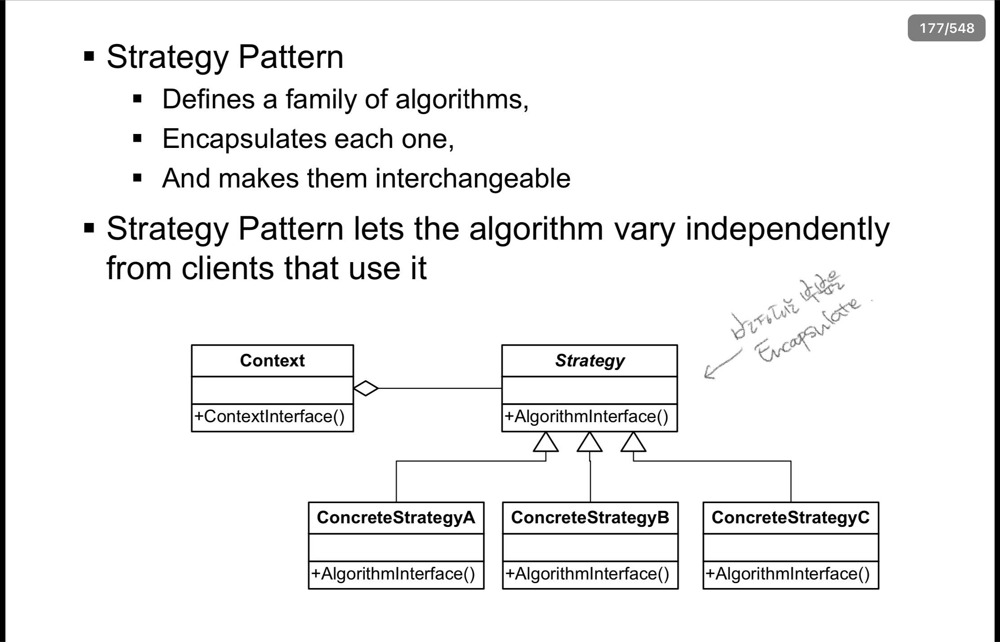
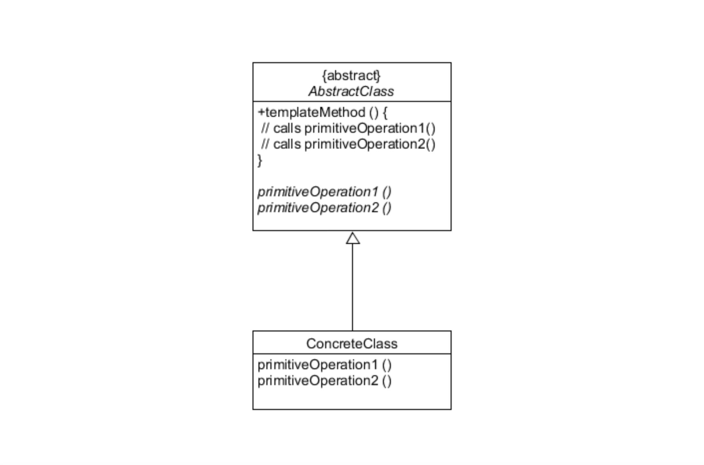

디자인 패턴 목록

1. Strategy Pattern
2. Observer Pattern
3. Template Method pattern
4. Iterator Pattern
5. State Pattern
6. Mediator Pattern
7. Factory Method Pattern
8. Abstract Factory Method Pattern
9. Builder Pattern
10. Singleton Pattern
11. Decorator Pattern
12. Adapter Pattern
13. Composite Pattern
14. Bridge Pattern
15. MVC Pattern

## Strategy Pattern

> 동일 계열의 알고리즘군을 정하고, 각 알고리즘을 캡슐화하며, 이들을 상호교환이 가능하도록 만듭니다. 알고리즘을 사용하는 클라이언트와 상관없이 독립적으로 알고리즘을 다양하게 변경할 수 있게 합니다. 

### Use when

- 연관된 클래스의 다른점이 오직 행동일 때
- 다양한 버전 또는 변형의 알고리즘이 요구 될 때
- 클래스의 행동(behavior)가 runtime에 정의 될 때
- 조건문이 복잡하고 유지가 어려울 때 

### 디자인 원칙

* composition

* delegation

  

## Observer Pattern

> 객체 사이에 일 대 다의 의존 관계를 정의해 두어, 어떤 객체의 상태가 변할 때 그 객체에 의존성을 가진 다른 객체들이 그 변화를 통지 받고 자동으로 갱신될 수  있게 만든다.

### Use When

* 통신을 하면서 Loose coupling이 필요할 때
* Broadcasting 이 필요할 때
* 상태 변화를 하나 또는 여러 객체에 알릴 때

## Template Method Pattern

> 객체의 연산에는 알고리즘의 뼈대만을 정의하고 각 단계에서 수행할 구체적 처리는 서브클래스 쪽으로 미룹니다. 알고리즘의 구조 자체는 그대로 놔둔 채 알고리즘 각 단계 처리를 서브클래스에서 재정의 할 수 있게 합니다.
>
> (스텝 정의라고 생각)

## Use When

* 어떤 한 알고리즘을 이루는 부분 중 변하지 않는 부분을 한 번 정의해 놓고 다양해질 수 있는 부분은 서브클래스에서 정의 할 수 있도록 할 때

## Iterator

> 내부 표현부를 노출하지 않고 어떤 집합 객체에 속한 원소들을 순차적으로 접근할 수 있는 방법을 제공합니다.

### Use When

* 각 요소에 접근하되 내부 전체를 노출 하고 싶지 않을 때
* 집합 객체를 순회하는 다양한 방법을 지원하고 싶을 때

### 디자인 원칙

* Single Responsibility (SRP)